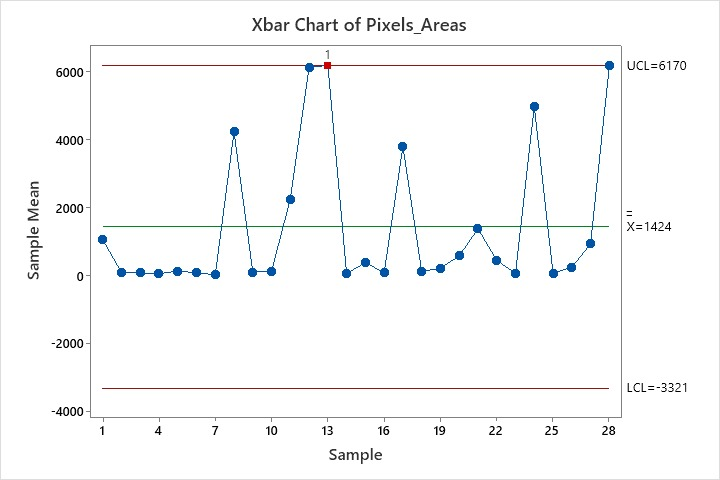
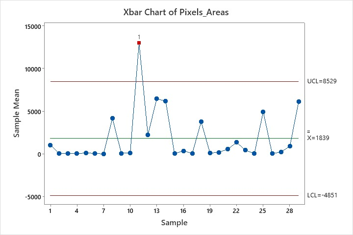
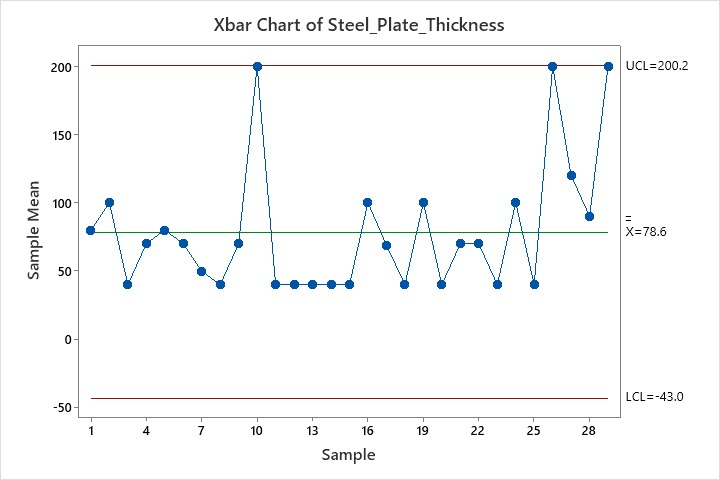
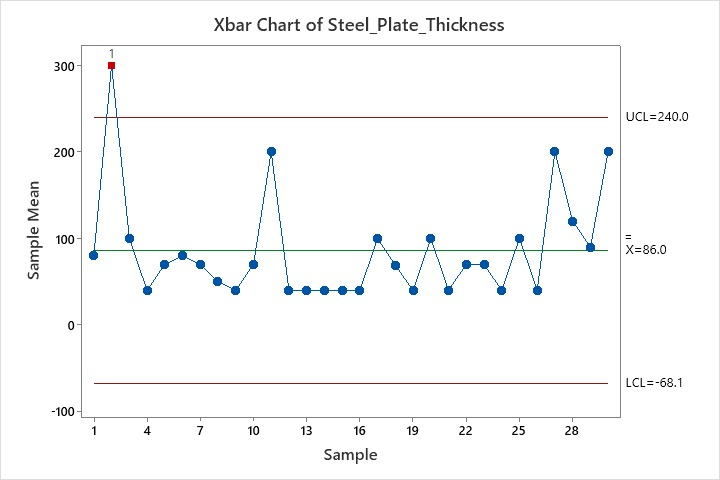
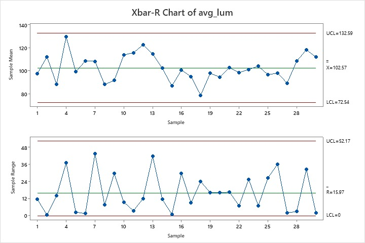

# stellarsteel-surface-quality-analysis
Statistical Process Control (SPC) analysis of stainless-steel finishing line to detect defects, shifts, and improve quality stability.
# 🔩 Stainless Steel Quality Control – SPC Analysis (ST2008 Project)
📌 Project Overview
This project analyzes the surface finishing process of stainless-steel plates at Stellar-Steel Inc. using Statistical Process Control (SPC) techniques. The goal is to detect process shifts, identify special causes of variation, and ensure consistent product quality.
🎯 Objectives
- Monitor surface defect patterns in the finishing line
- Detect shifts or abnormal variations in quality
- Improve process stability and reduce defects
- Support customer satisfaction and cost reduction
 🏭 Industrial Importance
Maintaining high surface quality is critical because:
- Defects lead to rejected shipments and financial loss
- Early detection reduces rework and scrap costs
- Stable processes improve predictability and efficiency
- Ensures safety and customer trust in final products
 📊 Methods Used
- Descriptive Statistics
- Control Charts (c-chart / p-chart / X̄-R chart)
- Trend and pattern analysis
- Process stability evaluation
 📈 Key Outcomes
- Identification of process variations
- Detection of potential special causes
- Insights into defect trends over time
- Recommendations for quality improvement
 🛠 Tools Used
- Python / Excel (based on your work)
- Minitab (if used)
- Statistical Quality Control techniques
👥 Team Project
Course: ST2008 – Quality Control  
Year: 2nd Year Semester 1  
📂 Files in this Repository
- Dataset (CSV)
- Analysis code / calculations
- Final report (PDF)
- Graphs and control charts
🚀 Conclusion
This study demonstrates how SPC tools can effectively monitor manufacturing quality and help maintain stable production processes in industrial environments.

  

